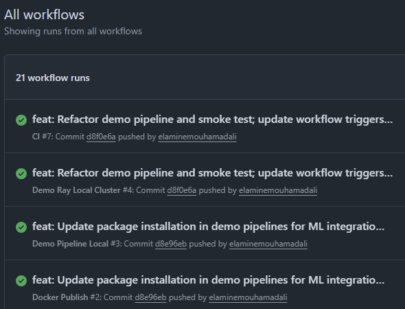
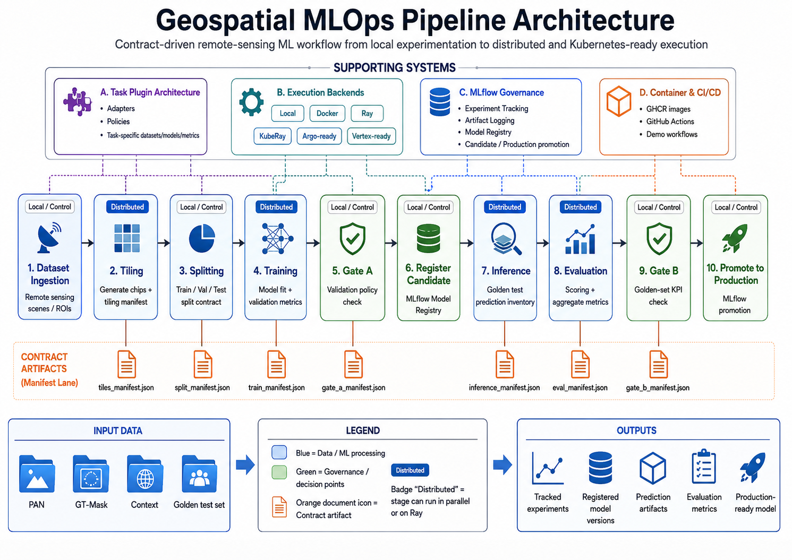
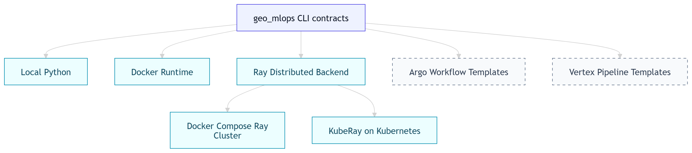
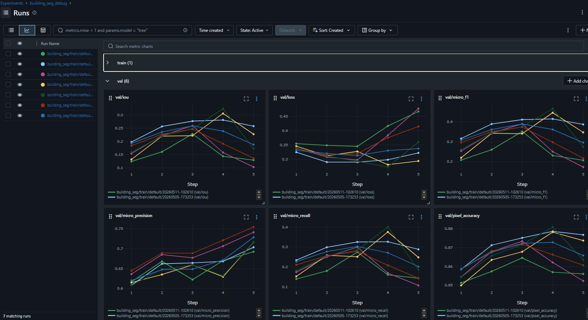
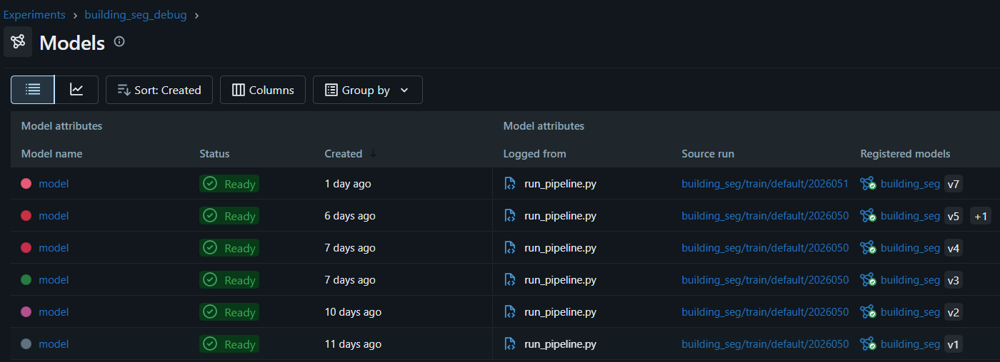
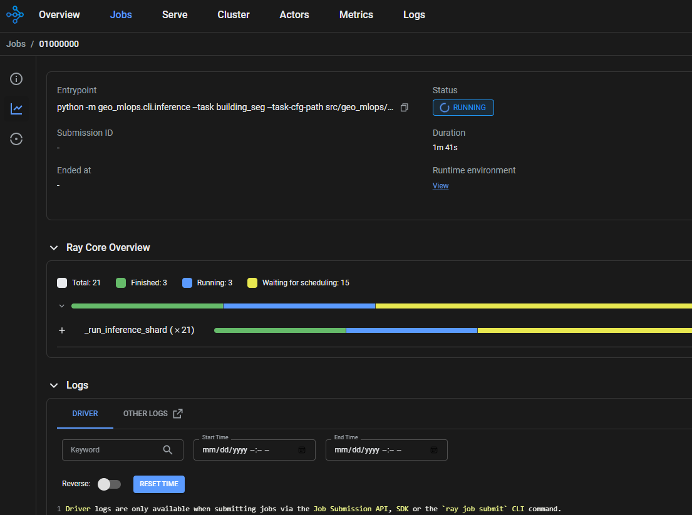
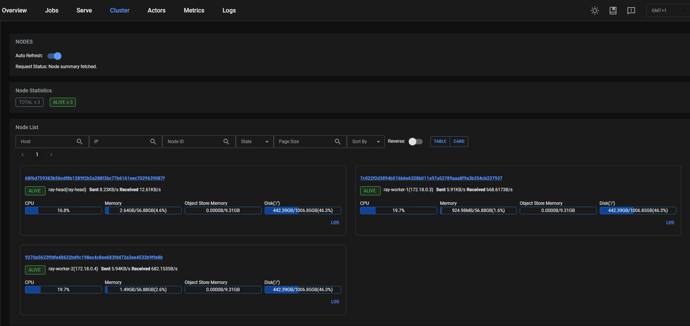
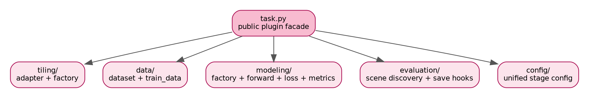

# Geospatial MLOps Pipeline

A contract-driven MLOps framework for remote-sensing workflows, built to move geospatial ML tasks from local experimentation to reproducible Docker, MLflow, Ray-distributed, and Kubernetes-ready execution.

[](https://github.com/elaminemouhamadali/geospatial-mlops-pipeline/actions/workflows/ci.yml)
[](https://github.com/elaminemouhamadali/geospatial-mlops-pipeline/actions/workflows/docker-publish.yml)
[](https://github.com/elaminemouhamadali/geospatial-mlops-pipeline/actions/workflows/demo-pipeline-local.yml)
[](https://github.com/elaminemouhamadali/geospatial-mlops-pipeline/actions/workflows/demo-pipeline-ray.yml)

## 📌 Quick links

- [🚀 What this repo demonstrates](#what-this-repo-demonstrates)
- [✅ Verified execution paths](#verified-execution-paths)
- [🏗️ System overview](#system-overview)
  - [📄 Contract artifacts](#contract-artifacts)
  - [🎯 Execution targets](#execution-targets)
- [🧪 Tiny building-segmentation demo](#tiny-building-segmentation-demo)
  - [📁 Demo data layout](#demo-data-layout)
  - [🧬 Start MLflow locally](#start-mlflow-locally)
  - [▶️ Run the local demo](#run-the-local-demo)
- [📊 MLflow governance](#mlflow-governance)
- [⚡ Ray distributed execution](#ray-distributed-execution)
  - [🧪 Run the local Ray smoke demo](#run-the-local-ray-smoke-demo)
- [🐳 Docker images and GHCR](#docker-images-and-ghcr)
- [☸️ Kubernetes / KubeRay readiness](#kubernetes--kuberay-readiness)
- [🧩 Orchestration targets](#orchestration-targets)
  - [🔁 Argo Workflows](#argo-workflows)
  - [☁️ Vertex Pipelines](#vertex-pipelines)
- [🧱 Task plugin architecture](#task-plugin-architecture)
- [🗂️ Repository structure](#repository-structure)
- [📚 Documentation](#documentation)
- [🌟 Technical highlights](#technical-highlights)

---
<a id="what-this-repo-demonstrates"></a>
## 🚀 What this repo demonstrates

This repository is not just a segmentation model. It is a reusable geospatial ML lifecycle system built around explicit stage contracts, task plugins, MLflow governance, Dockerized runtimes, and Ray-enabled distributed execution.

The current implementation uses building segmentation as the reference task, but the repository structure is designed so additional remote-sensing tasks can plug into the same lifecycle.

Core ideas:

- **Contract-driven stages:** every major stage writes a manifest consumed by downstream stages.
- **Task plugin architecture:** task-specific datasets, models, losses, metrics, tiling adapters, and evaluators are isolated from the core pipeline.
- **MLflow governance:** training runs, artifacts, model versions, candidate registration, and promotion gates are tracked explicitly.
- **Distributed execution:** inference and evaluation can run locally or through Ray-backed sharding.
- **Deployment path:** Docker images are published to GHCR, with local Ray and KubeRay-ready deployment templates.

---
<a id="verified-execution-paths"></a>
## ✅ Verified execution paths

| Workflow | What it proves |
|---|---|
| [CI](https://github.com/elaminemouhamadali/geospatial-mlops-pipeline/actions/workflows/ci.yml) | Linting, formatting, and tests pass |
| [Docker Publish](https://github.com/elaminemouhamadali/geospatial-mlops-pipeline/actions/workflows/docker-publish.yml) | Runtime images are built and published to GHCR |
| [Demo Pipeline Local](https://github.com/elaminemouhamadali/geospatial-mlops-pipeline/actions/workflows/demo-pipeline-local.yml) | Full tiny building-segmentation lifecycle runs with MLflow tracking |
| [Demo Ray Local Cluster](https://github.com/elaminemouhamadali/geospatial-mlops-pipeline/actions/workflows/demo-pipeline-ray.yml) | Docker Compose Ray cluster starts and executes distributed worker tasks |

The demo workflows upload pipeline outputs, MLflow metadata, Ray logs, and smoke-test artifacts as GitHub Actions artifacts.



---
<a id="system-overview"></a>
## 🏗️ System overview



The diagram above shows the full system: task plugins, execution backends, MLflow governance, Docker/CI, and the end-to-end ML lifecycle.

<a id="contract-artifacts"></a>
### 📄 Contract artifacts

| Stage | Contract / artifact | Purpose |
|---|---|---|
| Tiling | `tiles_manifest.json` | Records generated chip inventory, task config, dataset roots, tiling policy, and master CSV path |
| Splitting | `split_manifest.json` | Records deterministic train/validation/test split outputs and grouping or stratification metadata |
| Training | `train_manifest.json` | Records model checkpoint path, training config, metrics, and optional MLflow run metadata |
| Gate A | `gate_a_manifest.json` | Records validation-gate decision used to accept or reject candidate registration |
| Candidate registration | `registry_candidate.json` | Records candidate model registration metadata from MLflow |
| Inference | `inference_manifest.json` | Records golden-set inference configuration and prediction inventory path |
| Inference | `prediction_inventory.csv` | Tabular inventory of saved predictions, probabilities, logits, source scenes, and GT paths |
| Evaluation | `eval_manifest.json` | Records scoring configuration, metrics path, per-scene metrics table, and analytics artifacts |
| Evaluation | `metrics.json` | Machine-readable aggregate metrics used by promotion gates |
| Gate B | `gate_b_manifest.json` | Records golden-set KPI decision used to promote or reject the candidate model |
| Production promotion | `registry_production.json` | Records production model promotion metadata from MLflow |


The key design choice is that pipeline stages communicate through explicit contracts rather than hidden in-memory state. A downstream stage does not need to know whether the previous stage ran locally, inside Docker, or through Ray. It only needs the previous stage’s contract artifact.

This is what allows the same pipeline to support:

- local development
- Dockerized execution
- Ray-distributed inference and evaluation
- KubeRay deployment templates
- Argo or Vertex orchestration

<a id="execution-targets"></a>
### 🎯 Execution targets



The orchestrator can change without changing the core stage contracts. Argo, KubeRay, and Vertex are deployment/orchestration targets around the same CLI and manifest interface.

---
<a id="tiny-building-segmentation-demo"></a>
## 🧪 Tiny building-segmentation demo

The repository includes a small committed GeoTIFF fixture under `examples/tiny_building_seg/` so the pipeline can be executed without downloading a full remote-sensing dataset.

The demo is intentionally small, but it exercises the same production-style lifecycle used by the full pipeline:

1. Tile training scenes.
2. Create deterministic train/validation splits.
3. Train a task model.
4. Apply Gate A on validation metrics.
5. Register a candidate model in MLflow.
6. Run inference on a golden test set.
7. Score predictions against ground truth.
8. Apply Gate B on golden-set KPIs.
9. Promote the model in MLflow when policy checks pass.

<a id="demo-data-layout"></a>
### 📁 Demo data layout

```text
examples/tiny_building_seg/
  train_data/
    Khartoum/000
    Paris/000

  test_data/
    Khartoum/001
```

The demo uses the same task plugin and configuration interface as larger geospatial datasets. The tiny files are only used to make the repository self-validating and easy to run in CI.

<a id="start-mlflow-locally"></a>
### 🧬 Start MLflow locally

The full demo uses MLflow for experiment tracking, artifact logging, candidate registration, and production promotion. Start an MLflow server in one terminal:

```bash
mlflow server \
  --backend-store-uri sqlite:////tmp/geo_mlops_mlflow.db \
  --default-artifact-root /tmp/geo_mlops_mlruns \
  --host 127.0.0.1 \
  --port 5000
```

<a id="run-the-local-demo"></a>
### ▶️ Run the local demo

In another terminal, from the repository root:

```bash
bash examples/run_full_pipeline_local.sh
```

The `Demo Pipeline Local` GitHub Actions workflow starts MLflow inside the runner, executes the same tiny pipeline, and uploads generated contracts, metrics, MLflow metadata, and logs as workflow artifacts.

---
<a id="mlflow-governance"></a>
## 📊 MLflow governance

MLflow is used as the governance layer for the lifecycle. Training runs are logged as experiments, model artifacts are tracked, Gate A controls candidate registration, and Gate B controls production promotion.



The experiment view tracks validation metrics such as IoU, loss, micro-F1, precision, recall, and pixel accuracy across training runs.



The registry view tracks candidate model versions and promotion state for the `building_seg` model.

---
<a id="ray-distributed-execution"></a>
## ⚡ Ray distributed execution

Inference and evaluation support both local and Ray backends through the same CLI contract. The distributed runners shard scene or prediction records across Ray workers, write shard-level outputs, and let the driver merge those outputs into one authoritative final contract.

```text
Input contract / inventory
        ↓
Shard records across Ray workers
        ↓
Workers write shard outputs
        ↓
Driver merges outputs
        ↓
Final inference or evaluation contract
```

This pattern is currently used for:

- distributed full-scene inference
- distributed prediction scoring / evaluation
- local Ray cluster testing through Docker Compose



The Ray dashboard shows distributed inference shards executing across the cluster.



The local Ray demo starts a head node and worker nodes through Docker Compose and validates distributed execution with `infra/ray-local/docker-compose-local.py`.

<a id="run-the-local-ray-smoke-demo"></a>
### 🧪 Run the local Ray smoke demo

```bash
docker compose -f infra/ray-local/docker-compose.yml up -d

docker compose -f infra/ray-local/docker-compose.yml exec -T ray-head bash -lc '
  cd /workspace
  python infra/ray-local/smoke_test.py
'
```

Stop the cluster:

```bash
docker compose -f infra/ray-local/docker-compose.yml down -v
```

---
<a id="docker-images-and-ghcr"></a>
## 🐳 Docker images and GHCR

Runtime images are built and published by the `Docker Publish` GitHub Actions workflow.

| Image tag | Purpose |
|---|---|
| `ghcr.io/elaminemouhamadali/geospatial-mlops-pipeline:slim` | Base runtime for core CLI execution |
| `ghcr.io/elaminemouhamadali/geospatial-mlops-pipeline:ray-cpu` | Ray head/worker runtime for CPU distributed execution and smoke tests |

Local build files are under [`docker/`](docker/README.md).

Example pull:

```bash
docker pull ghcr.io/elaminemouhamadali/geospatial-mlops-pipeline:slim
docker pull ghcr.io/elaminemouhamadali/geospatial-mlops-pipeline:ray-cpu
```

---
<a id="kubernetes--kuberay-readiness"></a>
## ☸️ Kubernetes / KubeRay readiness

KubeRay templates are provided under [`infra/kuberay/`](infra/kuberay/) to show how the published Ray images map to Kubernetes-managed Ray clusters.

- [`raycluster-cpu.yaml`](infra/kuberay/raycluster-cpu.yaml)
- [`raycluster-gpu.yaml`](infra/kuberay/raycluster-gpu.yaml)

These manifests are environment-neutral templates. They assume:

- a Kubernetes cluster already exists
- the KubeRay operator is installed
- the cluster can pull the GHCR images
- dataset and output paths are provided through PVC, NFS, or object storage
- MLflow tracking URI and secrets are supplied by the target environment

The Kubernetes path is intentionally separated from the core pipeline logic. The same CLI contracts can run locally, in Docker, through Ray, or inside a KubeRay-managed cluster.

---
<a id="orchestration-targets"></a>
## 🧩 Orchestration targets

The pipeline is designed so orchestration systems wrap the same CLI and contract interface rather than rewriting pipeline logic.

<a id="argo-workflows"></a>
### 🔁 Argo Workflows


Ray-backed stages can either connect to an existing Ray cluster or submit KubeRay `RayJob` resources.

<a id="vertex-pipelines"></a>
### ☁️ Vertex Pipelines

Vertex is treated as a future managed-cloud orchestration target. The intended pattern is to wrap the same CLI stages in containerized Vertex components while preserving the same manifest contracts.

---

<a id="task-plugin-architecture"></a>
## 🧱 Task plugin architecture

Task-specific logic is isolated behind a plugin facade so the core pipeline can stay task-agnostic.



For the reference `building_seg` task, the plugin owns:

- tiling adapters and policies
- dataset and dataloader construction
- model factory and forward logic
- loss and metrics
- inference postprocessing and save hooks
- prediction-row evaluation and metric accumulation
- unified task configuration

This lets the core pipeline drive the lifecycle while each task supplies only the domain-specific behavior it needs.

---

<a id="repository-structure"></a>
## 🗂️ Repository structure

```text
.github/workflows/
  ci.yml
  demo-pipeline-local.yml
  demo-pipeline-ray.yml
  docker-publish.yml

docker/
  Dockerfile.slim
  Dockerfile.gpu
  Dockerfile.ray-cpu
  Dockerfile.ray-gpu

examples/
  run_full_pipeline_local.sh
  tiny_building_seg/

infra/
  kuberay/
    raycluster-cpu.yaml
    raycluster-gpu.yaml
  ray-local/
    docker-compose.yml
    smoke_test.py

src/geo_mlops/
  cli/
    tile.py
    split.py
    train.py
    gate.py
    register.py
    inference.py
    evaluate.py
    run_pipeline.py

  core/
    config/
    contracts/
    data/
    evaluation/
    execution/
    gating/
    inference/
    io/
    registry/
    splitting/
    tiling/
    training/
    utils/

  tasks/
    segmentation/
      building/
        config/
        data/
        evaluation/
        inference/
        modeling/
        tiling/
        task.py

tests/
```

---

<a id="documentation"></a>
## 📚 Documentation

- [Pipeline walkthrough](src/geo_mlops/cli/README.md)
- [Core engines](src/geo_mlops/core/README.md)
- [Task plugins](src/geo_mlops/tasks/README.md)
- [Docker images](docker/README.md)
- [Local Ray cluster](infra/ray-local/docker-compose.yml)
- [KubeRay templates](infra/kuberay/)

---

<a id="technical-highlights"></a>
## 🌟 Technical highlights

- Designed a contract-driven geospatial ML lifecycle with explicit manifests between pipeline stages.
- Implemented task plugin boundaries for task-specific tiling, datasets, models, inference, and evaluation logic.
- Integrated MLflow tracking, artifact logging, candidate registration, and production promotion gates.
- Added Ray-distributed inference and evaluation with shard-level worker outputs and driver-side contract merging.
- Built Docker runtimes and published CPU runtime images to GitHub Container Registry.
- Added GitHub Actions workflows for CI, image publishing, full local demo execution, and Ray cluster smoke testing.
- Provided Kubernetes-ready KubeRay templates and an Argo-compatible orchestration path.